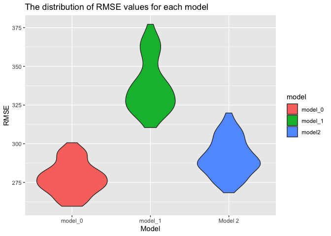

p8105_hw6_st3431
================
2022-11-28

## R Markdown

``` r
library(tidyverse)
```

    ## ── Attaching packages ─────────────────────────────────────── tidyverse 1.3.2 ──
    ## ✔ ggplot2 3.3.6      ✔ purrr   0.3.4 
    ## ✔ tibble  3.1.8      ✔ dplyr   1.0.10
    ## ✔ tidyr   1.2.0      ✔ stringr 1.4.1 
    ## ✔ readr   2.1.2      ✔ forcats 0.5.2 
    ## ── Conflicts ────────────────────────────────────────── tidyverse_conflicts() ──
    ## ✖ dplyr::filter() masks stats::filter()
    ## ✖ dplyr::lag()    masks stats::lag()

``` r
library(modelr)
```

**Problem 2**

``` r
crimes_df=
  read_csv("hw6_data/homicide-data.csv") %>% 
  unite("city_state", c("city", "state"), sep = ", ") %>% 
  mutate(solved = ifelse(disposition == "Closed by arrest", 1, 0), 
         victim_race = ifelse(victim_race != "White", "Black", "White"), 
         victim_race = fct_relevel(victim_race, "White", "Black"),
         victim_age = as.numeric(victim_age)) %>% 
  filter(!(city_state %in% c("Dallas, TX", "Phoenix, AZ", "Kansas City, MO", "Tulsa, AL")))
```

    ## Rows: 52179 Columns: 12
    ## ── Column specification ────────────────────────────────────────────────────────
    ## Delimiter: ","
    ## chr (9): uid, victim_last, victim_first, victim_race, victim_age, victim_sex...
    ## dbl (3): reported_date, lat, lon
    ## 
    ## ℹ Use `spec()` to retrieve the full column specification for this data.
    ## ℹ Specify the column types or set `show_col_types = FALSE` to quiet this message.

    ## Warning in mask$eval_all_mutate(quo): NAs introduced by coercion

Logistic regression with Baltimore

``` r
balt_regression=
  crimes_df %>% 
  filter(city_state == "Baltimore, MD") %>% 
  glm(solved ~ victim_sex + victim_race + victim_age, data = ., family = binomial)

broom::tidy(balt_regression) %>% 
  mutate(or = exp(estimate), 
        lower_CI = exp(estimate - 1.96*std.error), 
         upper_CI = exp(estimate + 1.96*std.error)) %>% 
  filter(term == "victim_sexMale") %>% 
  select(or, lower_CI, upper_CI) %>% 
  knitr::kable(digits = 3)
```

|    or | lower_CI | upper_CI |
|------:|---------:|---------:|
| 0.412 |    0.315 |    0.537 |

The estimated odds of a crime being solved for a male victim is 0.412
times the estimated odds of a crime being solved for a female victim. We
are 95% confident that the true odds ratio lies between the 0.315 and
0.537.

``` r
all_cities= 
  crimes_df %>% 
  group_by(city_state) %>% 
  nest() %>% 
  mutate(logit_solve = map(data, ~glm(solved ~ victim_sex + victim_race + victim_age, 
                                      family = binomial, data = .x)), 
         logit_solve = map(logit_solve, broom::tidy)) %>% 
  select(-data) %>% 
  unnest() %>% 
  filter(term == "victim_sexMale") %>% 
  mutate(or = exp(estimate), 
         lower_CI = exp(estimate - 1.96*std.error), 
         upper_CI = exp(estimate + 1.96*std.error), 
         city_state = fct_reorder(city_state, estimate)) %>% 
  select(city_state, or, lower_CI, upper_CI)  
```

    ## Warning: `cols` is now required when using unnest().
    ## Please use `cols = c(logit_solve)`

``` r
  all_cities %>% 
  ggplot(aes(x = city_state, y = or)) + 
  geom_point() + 
  geom_errorbar(aes(ymin = lower_CI, ymax = upper_CI)) + 
  coord_flip() + 
  labs(title = "Odds for solving crimes with male victims compared to crimes with female victims among different cities", 
       y = "Odds ratio", 
       x = "City")
```

<!-- -->

The plot demonstrates that most cities have a point estimate below 1,
with only Albuquerque, NM, New Orleans, L, and Stockton, CA having an
odds ratio greater than 1, indicating that in these cities the odds of a
male victim crime being solved is higher than a female victim crime.

**Problem 3**

``` r
birthweight_df = 
  read_csv("hw6_data/birthweight.csv") %>% 
  janitor::clean_names() 
```

    ## Rows: 4342 Columns: 20
    ## ── Column specification ────────────────────────────────────────────────────────
    ## Delimiter: ","
    ## dbl (20): babysex, bhead, blength, bwt, delwt, fincome, frace, gaweeks, malf...
    ## 
    ## ℹ Use `spec()` to retrieve the full column specification for this data.
    ## ℹ Specify the column types or set `show_col_types = FALSE` to quiet this message.

``` r
skimr::skim(birthweight_df)$n_missing
```

    ##  [1] 0 0 0 0 0 0 0 0 0 0 0 0 0 0 0 0 0 0 0 0

``` r
bwt_cleaned =
  birthweight_df %>%
  mutate(babysex = recode(babysex,'1' = 'male', '2' = 'female'),
         babysex = factor(babysex, levels = c('male', 'female')),
         frace = recode(frace,
                        '1' = 'White',
                        '2' = 'Black',
                        '3' = 'Asian',
                        '4' = 'Puerto Rican',
                        '8' = 'Other',
                        '9' = 'Unknown'), 
         frace = factor(frace, levels = c('White', 'Black', 'Asian', 'Puerto Rican', 'Other')),
         malform = recode(malform, '0' = 'absent', '1' = 'present'),
         malform = factor(malform, levels = c('absent', 'present')), 
         mrace = recode(mrace,
                        '1' = 'White',
                        '2' = 'Black',
                        '3' = 'Asian',
                        '4' = 'Puerto Rican',
                        '8' = 'Other'), 
         mrace = factor(mrace, levels = c('White', 'Black', 'Asian', 'Puerto Rican', 'Other')))
```

Doing a regression model for birthweight.

According to the 2022 study by Shaohua et. al., the biggest influences
for birthweight is maternal weight gain, gestational weeks, and mothers
smoking status. There is also research done by Universities such as
Stanford indicating that there exists racial disparities in birthweight
which is why I chose to include race in the regression model as well.

``` r
bwt_regression =
  lm(bwt ~ bhead + blength  + mrace + mheight + wtgain + smoken + gaweeks, 
     data = bwt_cleaned)

bwt_model=
bwt_cleaned %>% 
  add_predictions(bwt_regression) %>% 
  add_residuals(bwt_regression) 

bwt_model %>% 
  ggplot(aes(x = bwt, y = resid, color= resid)) +
  geom_point(alpha = 0.5) +
  labs(x = "Fitted values",
    y = "Residuals",
    title = "Fitted Values vs Residuals")
```

<!-- -->

Comparing model to two others

``` r
model_1= lm(bwt ~ blength + gaweeks, data=bwt_cleaned)

model_2= lm(bwt ~ bhead + blength + babysex +
              bhead * blength + 
              bhead * babysex + 
              blength * babysex + 
              bhead * blength * babysex, data= bwt_cleaned)
cv_df = 
  crossv_mc(bwt_cleaned, 100) 

cv_df = cv_df %>% 
  mutate(
    model_0 = map(train, ~lm(bwt ~ smoken + wtgain + bhead + blength + mrace + gaweeks, data = .)),
    model_1 = map(train, ~lm(bwt ~ blength + gaweeks, data = .)),
    model_2 = map(train, ~lm(bwt ~ bhead + blength + babysex + bhead * blength + bhead * babysex + blength * bhead + bhead * blength * babysex, data = .)),
  ) %>% 
  mutate(
    rmse_model_0 = map2_dbl(model_0, test, ~rmse(model = .x, data = .y)),
    rmse_model_1 = map2_dbl(model_1, test, ~rmse(model = .x, data = .y)),
    rmse_model2 = map2_dbl(model_2, test, ~rmse(model = .x, data = .y))
  )

cv_df %>% 
  select(starts_with("rmse")) %>% 
  pivot_longer(
    everything(),
    names_to = "model",
    values_to = "rmse",
    names_prefix = "rmse_"
  ) %>% 
  mutate(model = fct_inorder(model)) %>% 
  ggplot(aes(x = model, y = rmse, fill = model)) + 
  geom_violin() +
  labs(
    x = "Model",
    y = "RMSE",
    title = "The distribution of RMSE values for each model"
  ) +
  scale_x_discrete(labels=c("model0" = "Model 0", "model1" = "Model 1",
                              "model2" = "Model 2"))
```

<!-- -->
